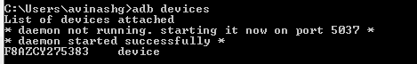
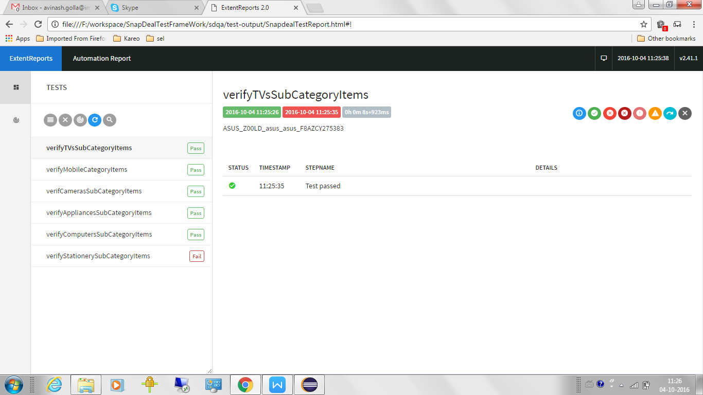
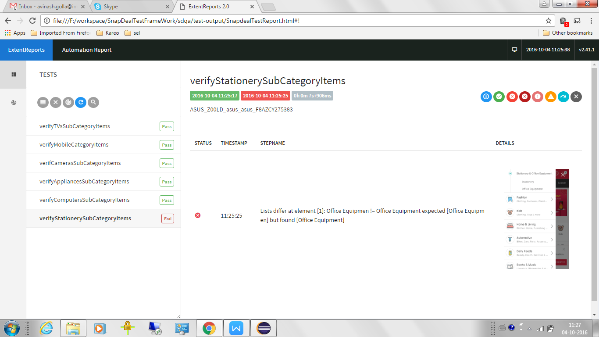
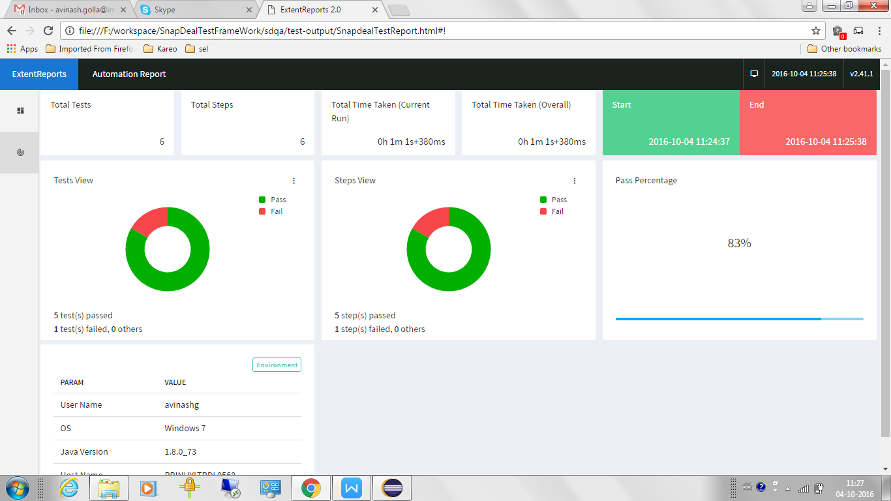

**SNAPDEAL TEST AUTOMATION**

**Objective :** This Objective of this project is about the test automation of the snapdeal mobile(web-based) and Native app using appium.

**Software Installations **

Ensure the software installations required for Appium is done. Follow the below steps for detailed installation procedure:

[https://docs.google.com/document/d/1l3H7FZB2gCbzvjDNW7RI91ORJmXI-2SsFeMxRbSN3O4/edit?ts=57f205fa](https://docs.google.com/document/d/1l3H7FZB2gCbzvjDNW7RI91ORJmXI-2SsFeMxRbSN3O4/edit?ts=57f205fa)

**Clone the project from gitlab**

Create a folder with name Appium. Navigate to the Appium folder in command prompt and Clone the project - SnapDealTestFrameWork by using the command 

**git clone ****[https://gitlab.pramati.com/purna.kathula/sdqa.gi**t](https://gitlab.pramati.com/purna.kathula/sdqa.git)

**Execution Steps**

1. Starting Appium server is not required for this project. Because we are handling it programmatically in the code.

2. Connect the mobile device to your laptop by using the cable. Ensure USB debugging option is toggled on your mobile.

3. Verify your mobile device is connected to your laptop properly by typing adb devices. It should list your device on the screen. If it is not detected means, your mobile is not connected properly to your machine.

4. Navigate to the Appium>SnapDealTestFrameWork and run the test cases by 

**  	mvn clean test -DsuiteXmlFile=nativeAppTest.xml**

**mvn clean test -DsuiteXmlFile=webTest.xml**

5. Extent Report would be generated in the test-output folder with the name    

     SnapdealTestReport.html

**Points to Remember: **

Android UIAutomator cannot recognize the objects when the App opened is under a test. Use UIAutomator only when the app is opened manually(not by appium in running/debugging mode).

**Limitations**** of Appium:**

1. Appium can’t be used to automate the apps developed with API level less 18. we can use Selendroid to automate those apps.

2. UI Automator cannot recognize the toast messages generated in the Native App, so we have to use OCR external libraries to handle this.

3. Recording the test script using Appium Inspector is not possible in windows environment. It supports only Mac operating system.

